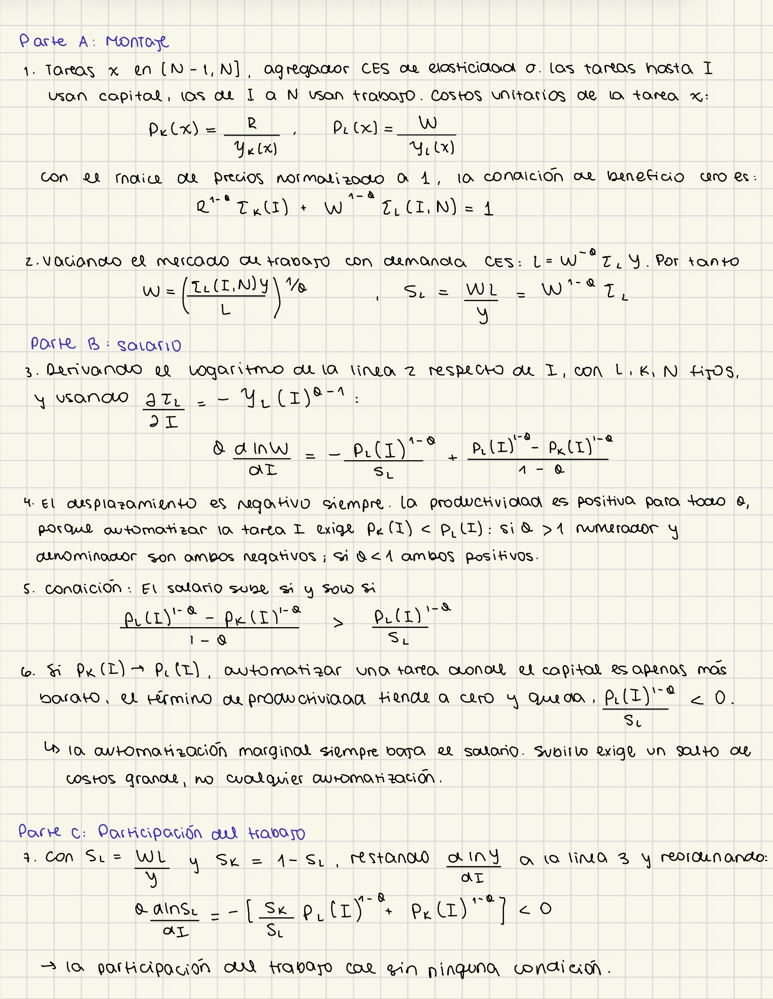

# Derivación manuscrita y alcance de la foto recibida

Guía de contraste (media carilla) para el caso de oferta laboral creciente. Usar $W$ para salario real, no $w=W/\gamma(I)$ normalizado. Fuente: **NBER WP 22252, rev. junio 2017**, Prop. 2 pp. 11–12, Prop. 3 pp. 12–13, prueba p. B-13, ecs. (B9)–(B10).

Bajo Assumptions 1–3, $K,N$ fijos, oferta creciente con $\varepsilon_L>0$ y $N-1<I^*=I<\widetilde I$ y $W/R<\gamma(N)$, escribir

$$s=\widehat\sigma,\quad H=\int_I^N\gamma(i)^{s-1}di,\quad
\Lambda_I=\frac{\gamma(I)^{s-1}}H+\frac1{I-N+1},\quad s_L=\frac{WL}{RK+WL}.$$

Para $s\ne1$, definir

$$P_I=\frac{B^{s-1}}{1-s}\left[\left(\frac W{\gamma(I)}\right)^{1-s}-R^{1-s}\right]>0.$$

Sea $x=\partial_I\ln W$, $z=\partial_I\ln R$. De (B9)–(B10),

$$s_Lx+(1-s_L)z=P_I,\qquad x-z=-\frac{\Lambda_I}{s+\varepsilon_L}.$$

Sustituir $z=x+\Lambda_I/(s+\varepsilon_L)$ en la primera:

$$\boxed{\frac{\partial W}{\partial I}=W\left[\underbrace{P_I}_{\text{productividad}}-\underbrace{(1-s_L)\frac{\Lambda_I}{s+\varepsilon_L}}_{\text{desplazamiento}}\right].}$$

Como $W>0$, terminar exactamente con

$$\boxed{\frac{\partial W}{\partial I}>0\iff
P_I>(1-s_L)\frac{\Lambda_I}{s+\varepsilon_L}.}$$

Para $s=1$, reemplazar solo $P_I$ por $\ln[W/(R\gamma(I))]$ (límite derivado).

## Foto original de la estudiante

La estudiante proporcionó `manual-verification.png` el 21 de septiembre de 2026. Se conserva sin retoques y se incluye en la diapositiva final. Su derivación usa **trabajo fijo**, una especialización diferente de la oferta creciente del análisis principal. La fórmula anterior sigue siendo la guía para el caso general.

### Cómo leer y verificar la hoja

Para las expresiones de la foto se toma $B=1$, $\eta=0$, $\sigma>0$ finito, $K,L,N$ fijos, $0<s_L<1$, y un umbral efectivo interior $I^*=I<\widetilde I$. Así $p_K(I)<p_L(I)$ y $Y=RK+WL$. Definir explícitamente

$$\mathcal T_K=\int_{N-1}^{I}\gamma_K(x)^{\sigma-1}dx,\qquad
\mathcal T_L=\int_I^N\gamma_L(x)^{\sigma-1}dx.$$

La notación con dos productividades es una generalización propia; para volver al caso del paper se normaliza $\gamma_K=1$ y $\gamma_L=\gamma$. Las tareas factibles para capital aún pueden usar trabajo: la asignación de la primera línea de la foto exige el régimen efectivo indicado.

Con $a=p_L(I)^{1-\sigma}$, $b=p_K(I)^{1-\sigma}$ y $P=(a-b)/(1-\sigma)$, las partes B y C quedan

$$\sigma\,\partial_I\ln W=P-\frac{a}{s_L},\qquad
\sigma\,\partial_I\ln s_L=-\left[\frac{1-s_L}{s_L}a+b\right]<0.$$

SymPy verifica ambas identidades en `sim.py`. La primera muestra el mismo balance económico, expresado desde la demanda laboral con $L$ fijo. No debe sustituirse automáticamente en la simulación principal, que permite ajustar $L$.

Dos precisiones a las frases manuscritas: «la automatización marginal siempre baja el salario» corresponde **al límite de ahorro de costos nulo** $p_K\to p_L$, no a todo incremento infinitesimal de $I$; «la participación cae sin ninguna condición» significa **sin exigir que domine el desplazamiento salarial**, manteniendo todos los supuestos de este párrafo. Para $\sigma=1$ se usa el límite $P=\ln(p_L/p_K)$, no una división por cero. Estas precisiones se anotan aquí sin modificar la imagen.

La foto fue aportada por la estudiante; este repositorio no inventa esa evidencia. La derivación fotografiada termina en la condición salarial que debe leerse con trabajo fijo:

$$\boxed{\partial_I W>0\iff
\frac{p_L(I)^{1-\sigma}-p_K(I)^{1-\sigma}}{1-\sigma}
>\frac{p_L(I)^{1-\sigma}}{s_L}.}$$
